# Mercatto — Diagnóstico y propuesta de rediseño de datos y flujos

Fecha del análisis: 2026-10-05. Rama analizada: `main` (último commit `d264bfb`).

Este documento es una propuesta. No se modificó código de la aplicación ni se ejecutaron migraciones. Para contrastar el código con el estado real se lanzaron consultas **de solo lectura** (metadatos y conteos agregados, sin datos personales) contra la base Supabase conectada al entorno de desarrollo. Por su volumen (21 torneos, 62 participantes, 494 jugadores) parece ser la base de producción; **confírmalo antes de usar estas cifras como referencia oficial**.

Convenciones del documento:

- **[Comprobado]**: verificado leyendo el código o consultando la base.
- **[Inferencia]**: deducido del código o de los datos, sin reproducirlo en ejecución.
- **[No encontrado]**: se buscó y no existe en el repositorio.
- **[Propuesta]** / **[Pendiente de validación]**: decisión de diseño que requiere confirmación de negocio.

Las rutas de código son relativas a la raíz del repositorio y se citan como `ruta:líneas`.

---

## Índice

1. Diagnóstico del diseño actual con evidencia del código
2. Reglas de negocio confirmadas y decisiones pendientes
3. Modelo de dominio recomendado
4. Diagrama y esquema propuesto
5. Funcionamiento de los flujos
6. Integridad, concurrencia e historial
7. Plan de migración
8. Orden recomendado de implementación

Anexos: A. Escenarios de validación · B. Pruebas de integración propuestas · C. Bocetos SQL

---

## 1. Diagnóstico del diseño actual

### 1.1 Stack y arquitectura de acceso a datos

- Next.js 16 (App Router) con route handlers en `app/api/**`, desplegado en Vercel. Supabase (PostgreSQL) mediante `@supabase/supabase-js` (`package.json`).
- **[Comprobado]** El servidor usa la **clave anónima pública** (`NEXT_PUBLIC_SUPABASE_ANON_KEY`), no la `service_role` (`lib/supabase.ts:62-75`).
- **[Comprobado]** Todas las tablas conceden `select/insert/update/delete/truncate` a `anon` (`supabase/migrations/00000000000000_schema.sql`, bloques `grant ... to anon`), y **34 de 35 tablas tienen RLS desactivado** (consulta a la base). Como la clave anónima viaja al navegador, cualquiera puede leer o modificar cualquier fila desde fuera de la aplicación, incluidos `members.budget`, `team_players` o los resultados de `fixtures`. Supabase marca esto como aviso crítico.
- **[Comprobado]** No existen funciones, triggers ni políticas en el repositorio ni en la base (`information_schema.routines` y `triggers` vacíos). **No hay ninguna llamada `rpc()`**. Cada operación de negocio son 5-30 llamadas HTTP independientes a PostgREST, **sin transacción**.
- **[Comprobado]** No hay pruebas automatizadas ni dependencias de testing (`package.json:5-10`).
- **[Comprobado]** El esquema está disperso y desincronizado: `supabase/migrations/00000000000000_schema.sql` dice ser "complete schema from production", pero no incluye `season_archives`, `team_budgets`, `club_expenses`, `slot_machine_*`, `players.salary`, `tournaments.current_season`, `tournaments.slot_machine_price` ni `teams.active`, que sí existen en la base y están en `sql/migrations/*.sql`, `migration_slot_machine.sql` o en ningún archivo.
- **[Comprobado]** El código lee columnas que no existen en la base: `tournaments.slots_enabled` (`app/api/tournaments/[code]/slot-machine/pool/route.ts:76`, `.../slot-machine/spin/route.ts:74`, `app/api/tournaments/[code]/route.ts:112-116`), `teams.squad_value` y `teams.budget` (`app/api/tournaments/[code]/teams/route.ts:45`). **[Inferencia]** PostgREST responde con error y el código cae en valores por defecto; por ejemplo, la tragaperras queda siempre "habilitada".

### 1.2 Inventario real de tablas

Confirmado contra la base (35 tablas en `public`):

| Grupo | Tablas | Observaciones |
|---|---|---|
| Catálogo | `teams`, `players`, `team_players` | Se modifican desde el juego (ver 1.3). |
| Torneo y participantes | `tournaments`, `members`, `assignments` | `members` guarda presupuesto y contadores de mercado. |
| Mercado | `market_sessions`, `market_transfers`, `market_offers`, `market_turns`, `icon_auctions`, `icon_bids`, `icon_activation_votes`, `icon_selection_votes`, `icon_votes` | `market_turns`: 0 filas (sistema de turnos heredado). |
| Liga | `league_sessions`, `fixtures`, `matchday_rests`, `discipline`, `suspensions`, `lineups` | Una liga por torneo (`unique`). |
| Temporadas | `season_archives`, `season_archive_fixtures`, `season_archive_assignments`, `team_budgets` | Instantáneas JSON y saldo por equipo. |
| Finanzas | `club_expenses` | **0 filas** (ver 1.6). |
| Tragaperras ("slots") | `slot_machine_pool`, `slot_machine_spins` | Rutas activas aunque el enlace esté oculto en la UI. |
| Social | `social_profiles`, `posts`, `post_likes` | Ligadas a `members`. |
| Notificaciones | `notifications`, `push_subscriptions` | Ligadas a `members`. |
| Muertas | `member_roster` (solo se borra, nunca se escribe: `season/next/route.ts:342`), `listings` (0 filas, sin uso) | |

Los nombres del enunciado se corresponden así: `player` es `players`; `discipline` y `suspensions` coinciden; `fixture` es `fixtures`; `post` es `posts`; `likes` es `post_likes`. No hay tabla de usuarios: la identidad es `members`, con un token por torneo.

### 1.3 Problema 1: los traspasos alteran el catálogo compartido

La plantilla de un club **no está almacenada en ninguna tabla del torneo**. Se recalcula en cada lectura con la fórmula "`team_players` del equipo asignado + transferencias de la `market_session` actual del torneo". Hay **cuatro implementaciones distintas** de ese cálculo:

| Implementación | Ubicación | Diferencias |
|---|---|---|
| Plantilla propia | `app/api/tournaments/[code]/squad/route.ts:47-124` | Recorrido cronológico; considera `auto_release`. |
| Mercado | `app/api/tournaments/[code]/market/route.ts:169-209` | Solo incluye jugadores de equipos asignados. |
| Salarios y liberación automática | `lib/expenses.ts:70-171` | Toma la última `market_session` por `created_at`. |
| Plantillas de un partido | `app/api/tournaments/[code]/league/fixtures/[fixtureId]/squads/route.ts:74-97,145-160` | Agrupa por `seller_team_id` **sin orden cronológico**; resuelve mal las cadenas A→B→C. |

Hay **tres rutas que escriben en `team_players`**, es decir, en el catálogo global que comparten todos los torneos:

1. **[Comprobado] Nueva temporada.** `app/api/tournaments/[code]/season/next/route.ts:226-287` "materializa" las transferencias del torneo en `team_players`: borra el vínculo con el equipo antiguo e inserta el nuevo. El propio archivo lo advierte en `season/next/route.ts:17-19` ("this permanently mutates team_players"). **Es la causa directa del ejemplo del enunciado**: tras cerrar la temporada en el torneo A, el jugador aparece en Liverpool en el torneo B. A continuación borra `market_transfers` (`:305`), con lo que el historial del torneo A desaparece.
2. **[Comprobado] Liberación automática por deuda.** `lib/expenses.ts:264-272` borra la fila `team_players(team, jugador)` en mitad de una temporada. Esa liberación afecta inmediatamente a **todos los torneos** donde se use ese equipo.
3. **[Comprobado] Tragaperras.** `app/api/tournaments/[code]/slot-machine/accept/route.ts:105-114` hace `upsert` del premio en `team_players` del equipo del ganador **sin quitarlo de su equipo de origen**. El jugador queda en dos equipos del catálogo, en todos los torneos.

Además, **siete rutas escriben en `players`** (catálogo global de jugadores):

- **[Comprobado]** Pagar una cláusula sobrescribe `players.price` y, si es icono, `players.clause` (`market/clause/route.ts:309-322`). Como el salario se calcula con `players.price` (`lib/expenses.ts:158-166` y `league/fixtures/[fixtureId]/result/route.ts:193-194`), **una compra en el torneo A cambia el salario y la cláusula de ese jugador en todos los torneos**.
- **[Comprobado]** Las subastas de iconos fijan `players.clause` al liquidarse: `market/route.ts:109-113`, `auctions/route.ts:170-172`, `auctions/[auctionId]/route.ts:263`, `market/icon-auction/bid/route.ts:35-36`, `market/icon-auction/pass/route.ts:38`, `market/icon-auction/route.ts:117`, `cron/market/route.ts:244-248`; también lo hacen la aceptación de ofertas (`market/offer/[offerId]/route.ts:262-266`) y un "autoarreglo" ejecutado en una **lectura** (`market/route.ts:297-300`).

Consecuencias en el código:

- **[Comprobado]** Varias rutas asumen que un jugador está en un único equipo (`.maybeSingle()` o `.single()` sobre `team_players` filtrando por `player_id`): `market/clause/route.ts:109-114`, `market/offer/route.ts:110-115`, `market/action/route.ts:106-110`. **[Inferencia]** Con jugadores duplicados en el catálogo, esas consultas devuelven error y el vendedor no se resuelve.
- **[Comprobado]** Hay evidencia de corrupción ya corregida a mano: `sql/fixes/fix_transfers.sql` intercambia comprador y vendedor en transferencias cuyo jugador ya figuraba en la plantilla base del comprador, efecto típico de la materialización.

Evidencia en la base [Comprobado]:

| Indicador | Valor |
|---|---|
| Jugadores presentes en más de un equipo del catálogo | **18** |
| — de ellos, procedentes de premios de la tragaperras | 4 |
| — de ellos, con transferencias registradas | 6 |
| Iconos dentro de `team_players` (deberían estar fuera del catálogo base) | **11** |
| Torneos con `current_season > 1` (ejecutaron la materialización) | 2 (ambos el 2026-04-24) |
| Equipos del catálogo usados a la vez en varios torneos | 16 |
| Filas del seed versionado (`supabase/seed.sql`) que todavía se resuelven a jugadores actuales | 135 de 388 |

### 1.4 Problema 2: el presupuesto vive en el participante

- **[Comprobado]** `members.budget` y `members.budget_reserved` (`schema.sql:26-41`). La migración lo declara así expresamente: "El presupuesto pertenece al participante (member), no al equipo" (`sql/migrations/migration_rerolls.sql:8-10`).
- **[Comprobado]** El código posterior contradice esa decisión: "Budget is owned by the TEAM, not the member" (`spin/route.ts:195-198`). El parche consistió en guardar el saldo final de cada miembro en `team_budgets(tournament_id, team_id)` al cerrar la temporada (`season/next/route.ts:313-332`) y copiarlo al miembro cuando elige ese equipo (`spin/route.ts:200-213`). Durante la temporada, el dinero sigue en el miembro.
- **[Comprobado]** Hay **trece rutas que modifican el saldo** con el patrón leer-calcular-escribir y sin bloqueo: `market/clause`, `market/action`, `market/offer/[offerId]` (comprador y vendedor), `market/route` (GET), `auctions/route` (GET), `auctions/[auctionId]` (GET), `auctions/[auctionId]/bid`, `market/icon-auction/{route,bid,pass}`, `cron/market`, `league/fixtures/[fixtureId]/result`, `lib/expenses.ts` (liberación automática), `slot-machine/spin`, `market/start` (inyección o recálculo), `market/reset`, `league/reset`, `season/next` y `spin` (POST).
- **[Comprobado]** Existen **tres fórmulas distintas** para el presupuesto inicial: según el OVR medio en `spin/route.ts:224-249`, inversamente proporcional al valor de plantilla en `market/start/route.ts:13-51`, y un valor fijo de 200M en `league/reset/route.ts:50-53`.
- **[Comprobado] Cambio de equipo sin límite real.** `POST /spin` acepta el `teamId` que envía el cliente, no valida el estado del torneo y la comprobación de *rerolls* usa `>` (`spin/route.ts:146-150`). Con `rerolls_allowed = rerolls_used`, la llamada pasa. Por tanto, un participante puede cambiar de equipo en plena liga y su presupuesto se **sobrescribe** con el del nuevo equipo o con la fórmula (`spin/route.ts:200-213`).

### 1.5 Problema 3: "otra liga dentro del mismo torneo"

- **[Comprobado]** `league_sessions.tournament_id` y `market_sessions.tournament_id` son `unique` (`schema.sql:148-167, 261-274`). Solo puede existir una liga y un mercado por torneo a la vez.
- **[Comprobado]** `POST /season/next` (`season/next/route.ts`) hace lo siguiente:
  1. Archiva clasificación y disciplina como JSON en `season_archives` y copia los partidos en `season_archive_fixtures` con nombres desnormalizados.
  2. Materializa las transferencias en el catálogo global (1.3).
  3. **Borra** subastas, ofertas, transferencias, turnos, la sesión de mercado y la liga, con sus partidos, disciplina y suspensiones en cascada (`:289-311`).
  4. Guarda el saldo de cada miembro en `team_budgets` del equipo que tenía.
  5. Borra asignaciones, alineaciones y `member_roster`.
  6. Pone `members.budget = null` y reinicia los contadores.
  7. Incrementa `current_season` y vuelve el torneo al estado `lobby`.
- Todo son llamadas independientes. **[Inferencia]** Un fallo a mitad deja el torneo en un estado intermedio irrecuperable: por ejemplo, con el catálogo ya mutado pero sin `team_budgets`. El *upsert* del archivo (`:176-191`) hace idempotente solo la primera parte.
- **Comportamiento actual de "elegir equipos nuevos conservando presupuesto y fichajes"** [Comprobado]: el patrimonio sigue **al equipo**, no a la persona. Quien elija Liverpool en la temporada 2 hereda el saldo final de Liverpool en la temporada 1 (`team_budgets`) y su plantilla con los fichajes materializados. Un equipo que nadie tuvo recibe un saldo calculado con la fórmula. El problema es que la plantilla se guarda en el ámbito global (catálogo) y el saldo en el ámbito del torneo, de forma incoherente.
- **[Comprobado]** El historial de fichajes y de finanzas **se pierde** al empezar una temporada. Solo sobreviven la clasificación, los partidos y la disciplina, como instantáneas desnormalizadas.

### 1.6 Problema 4: mercado de invierno

- **[Comprobado]** El invierno reutiliza **la misma fila** de `market_sessions`: `market_type = 'winter'` y límites en `winter_max_transfers` y `winter_clause_protection` (`market/start/route.ts:72-76, 154-189`). Al reabrir se borran subastas, ofertas y turnos de la ventana anterior (`:157-172`), pero se conservan sus transferencias, porque la plantilla se calcula a partir de ellas.
- **[Comprobado]** Para separar "lo de esta ventana" se filtra por `created_at >= started_at` (`market/route.ts:212-219, 379`; `market/clause/route.ts:180-187`). En la base hay **1 ventana de invierno** con transferencias anteriores a su `started_at`: los metadatos de la ventana de verano (fechas, duración) se sobrescribieron y no pueden recuperarse.
- **[Comprobado]** `market/reset` borra la sesión completa con todas sus transferencias, incluidas las de la ventana anterior (`market/reset/route.ts:77`), y **solo revierte el dinero** de `clause` y `offer` (`:31-60`): no revierte iconos ni liberaciones.
- **[Comprobado]** El invierno no se relaciona con el calendario: puede abrirse en cualquier momento y no comprueba la jornada. Tampoco cambia el estado del torneo (`market/start/route.ts:218-226`).
- **[Comprobado]** El cierre de mercado está repartido entre el cron (`cron/market/route.ts:71-122`), que en Vercel corre **una vez al día** (`vercel.json`), las lecturas `GET /market` y `GET /auctions` ("lazy close", `market/route.ts:51-123`, `auctions/route.ts:124-193`) y el cierre manual (`market/close/route.ts`).
- **[Comprobado] Doble cobro posible.** La liquidación de una subasta en las lecturas actualiza `phase = 'finished'` **sin condición sobre la fase previa** (`market/route.ts:79-82`; `auctions/route.ts:135-142`). **[Inferencia]** Dos `GET` concurrentes leen la subasta como activa y ambos cobran al ganador e insertan la transferencia. En la base no se encontraron duplicados de `icon_auction` (0), pero la ventana de carrera existe.
- **[Comprobado] El cron no registra el fichaje.** Al liquidar subastas inserta en `market_transfers` la columna `type: "auction"` (`cron/market/route.ts:234-241`), que no existe (la columna es `transfer_type`, `NOT NULL`). **[Inferencia]** La inserción falla: se cobra al ganador pero el icono nunca llega a su plantilla. Además no libera `budget_reserved`.
- **[Comprobado]** Conviven **dos sistemas de subasta de iconos** sobre la misma tabla: por turnos (`market/icon-auction/*`, que suma `market_purchases`, `bid/route.ts:21-24`) y con tiempo, estilo eBay (`auctions/*`, que marca `icon_slot_used` y no consume fichajes). Las reglas son incompatibles entre sí.

### 1.7 Problema 5: "slots" o cupos de jugadores libres

El código no usa la palabra "cupo". Los "slots" son la **tragaperras** (`slot_machine_pool`, `slot_machine_spins`, rutas `slot-machine/*`, página `/tragaperras`). Lo que hacen hoy, según el código y los datos:

| Concepto | Qué representa hoy | Evidencia |
|---|---|---|
| Pool diaria | Hasta ~100 filas por `(torneo, fecha UTC)`, tomadas de las plantillas base (`team_players`, global) de equipos **activos no asignados** en el torneo, agrupadas por rango de OVR. | `slot-machine/pool/route.ts:17-25, 113-190` |
| Slot | Una fila de la pool (`pool_slot_id`) con estado `available`, `claimed` o `empty`. | `migration_slot_machine.sql:7-19` |
| Giro | Se cobra `slot_machine_price` del presupuesto del **miembro** antes de decidir el resultado. 20% de premio. | `slot-machine/spin/route.ts:107-122, 125-149` |
| Consumo | Al aceptar, se marca el slot como `claimed` (comprobar y luego actualizar, **con carrera**), se inserta un reemplazo y se hace `upsert` en `team_players` (global). | `slot-machine/accept/route.ts:70-114` |
| Cupo diario | Por **miembro** y día UTC: 3 "premium" y 2 "regulares". | `slot-machine/accept/route.ts:45-66` |
| Liberación | **No existe.** Un giro rechazado o caducado no devuelve el dinero. Hay **85 giros `pending` ya caducados**, todos cobrados. | `slot-machine/reject/route.ts`, consulta a la base |
| Reinicio | Pool nueva cada día UTC. El jugador reclamado sigue en su equipo de origen dentro del catálogo, así que **puede volver a ofrecerse y reclamarse** otro día o en otro torneo. | `slot-machine/pool/route.ts:161-190` |
| Giros gratis | Se guardan en `localStorage` y se envían en la cabecera `X-Free-Spins`. **El servidor confía en el valor del cliente**: cualquiera gira gratis. | `app/Components/SlotMachine.tsx:101-146`; `slot-machine/spin/route.ts:91-92, 107` |

Hay **cuatro umbrales distintos de "premium"**: OVR > 80 al aceptar (`accept/route.ts:43`), a partir de 84 en la pool (`pool/route.ts:17-25`), > 83 en el reemplazo (`accept/route.ts:189`) y > 80 en el comentario de la migración.

**[Comprobado]** La UI se ocultó (commits `3a3e79a` "Disable slots" y `b0448f1` "remove slots link"), pero **las rutas siguen operativas** y la columna `slots_enabled` no existe.

Otros límites que funcionan como "cupos", también inconsistentes:

- `members.market_purchases` frente a `max_transfers` o `winter_max_transfers`. Se reinicia al abrir cualquier mercado (`market/start/route.ts:125-128`). La subasta por turnos lo consume; la de tipo eBay no.
- `members.icon_slot_used`: un icono por mercado (`auctions/[auctionId]/bid/route.ts:77-82`).
- Protección por cláusulas: máximo N cláusulas pagadas contra un mismo **equipo** por ventana (`market/clause/route.ts:180-194`).

### 1.8 Disciplina, suspensiones, partidos y resultados

- **[Comprobado]** `fixtures` referencia a **miembros**, no a clubes (`schema.sql:280-311`), y no guarda las alineaciones del partido. `lineups` es una sola fila por miembro, sin relación con ningún partido (`schema.sql:453-461`; `squad/lineup/route.ts`).
- **[Comprobado] Finalización sin idempotencia.** El resultado se confirma comprobando primero el estado (`result/route.ts:320-322`) y actualizando después sin condición (`:125-136`). **[Inferencia]** Dos confirmaciones simultáneas ejecutan dos veces `processDiscipline` y `processFinances`: tarjetas duplicadas, suspensiones duplicadas y salarios cobrados dos veces.
- **[Comprobado]** El `PATCH` de administración que fuerza un resultado no comprueba que el partido pertenezca al torneo del administrador (`result/route.ts:365-386`). Tampoco lo comprueban `GET .../squads` ni `POST .../result` (solo verifican que el miembro juega ese partido).
- **[Comprobado]** El cliente envía las tarjetas con `playerId` y `memberId` sin validarlos contra la plantilla (`result/route.ts:307, 333-341`).
- **[Comprobado]** La disciplina usa la jornada **actual de la liga**, no la del partido (`result/route.ts:115-118, 52-61`). Un partido aplazado y jugado más tarde genera suspensiones con jornadas incorrectas.
- **[Comprobado]** Las suspensiones se guardan por `(member_id, player_id)` y la plantilla las filtra por el miembro que consulta (`squad/route.ts:147-148`). Si el jugador cambia de club, la suspensión deja de aplicarse. En la base hay **4 suspensiones** de jugadores que cambiaron de dueño después de ser sancionados.
- **[Comprobado] Libro contable vacío.** `club_expenses` tiene RLS activado y **ninguna política**. El servidor usa la clave anónima, así que **[Inferencia, alta confianza]** todas las inserciones del libro se rechazan. `recordExpenses` solo registra el error en el log (`lib/expenses.ts:177-186`) y el descuento del saldo ya se ha aplicado antes (`result/route.ts:229-240`). Los datos lo confirman: **48 partidos finalizados después de que existiera la funcionalidad de finanzas (25 con tarjetas) y 0 filas en `club_expenses`**. Los salarios y las multas se cobraron sin dejar rastro.

### 1.9 Salida de participantes y red social

- **[Comprobado]** `DELETE /members/[memberId]` borra físicamente al miembro (`members/[memberId]/route.ts:37-55`). **[Inferencia]** Si el miembro tiene partidos o transferencias, falla: `fixtures.home_member_id`, `market_transfers.buyer_id`, etc. no tienen `ON DELETE`, así que aplican `NO ACTION`. Si no falla, `posts`, `post_likes`, `social_profiles`, `notifications` y `lineups` se borran **en cascada** (`schema.sql:544-576`): se pierde el historial social.
- **[Comprobado]** Lo social está ligado a `members` (ámbito torneo). `post_likes` no garantiza en base de datos que el *like* y el post sean del mismo torneo; solo lo valida la API (`social/posts/[postId]/like/route.ts:16-21`).
- **[Comprobado]** No hay cuentas de usuario globales. El "inicio de sesión" consiste en guardar un token UUID por torneo (`lib/tokenStorage.ts`) cuyo hash se compara en cada petición (`lib/supabase.ts:79-122`). `members.member_token_hash` es legible con la clave anónima.

### 1.10 Otros hallazgos de concurrencia y autorización

- **[Comprobado]** `POST /auctions/[auctionId]/bid` lee la subasta solo por `id`, sin comprobar el torneo (`auctions/[auctionId]/bid/route.ts:36-47`). Un miembro del torneo A puede pujar en una subasta del torneo B.
- **[Comprobado]** Aceptar una oferta no comprueba que el vendedor siga teniendo al jugador ni que el mercado siga dentro de `closes_at` (`market/offer/[offerId]/route.ts:61-72, 168-260`).
- **[Comprobado]** La cláusula no comprueba si el jugador ya se transfirió en esta ventana; la oferta sí lo hace (`market/offer/route.ts:92-107`).
- **[Comprobado]** En la base hay 1 miembro con `budget_reserved > budget`.

---

## 2. Reglas de negocio

### 2.1 Reglas confirmadas en el código actual

Se proponen como punto de partida; están marcadas las que cambian.

| # | Regla | Evidencia |
|---|---|---|
| R1 | Un equipo del catálogo solo puede tenerlo un participante por torneo. | `assignments unique(tournament_id, team_id)`, `schema.sql:100` |
| R2 | El participante elige equipo en una ruleta con N *rerolls* (0-5, por defecto 1). | `api/tournaments/route.ts:106-108`; `spin/route.ts` |
| R3 | La liga es una doble vuelta todos contra todos; con número impar, alguien descansa en cada jornada. | `league/start/route.ts:7-57` |
| R4 | Victoria 3 puntos, empate 1. Desempate: puntos, diferencia de goles, goles a favor. | `season/next/route.ts:113-131` |
| R5 | El resultado lo propone un participante y lo confirma el rival; un desacuerdo lo anula. El administrador puede forzarlo. | `result/route.ts:301-386` |
| R6 | Doble amarilla en el mismo partido = roja. Cada 3 amarillas acumuladas = 1 partido de sanción. Cada roja = 2 partidos. | `result/route.ts:20-40, 88-113` |
| R7 | Salario por partido = 10% del precio del jugador / número de jornadas. Multa: amarilla 0,5M y roja 2M. | `lib/expenses.ts:8-15, 30-33` |
| R8 | Si el saldo queda negativo, se libera el fichaje más caro y se recupera el 50%, hasta volver a ≥ 0. El jugador liberado no puede ficharse en esa ventana. | `lib/expenses.ts:204-304`; `market/clause/route.ts:126-131` |
| R9 | Mercado asíncrono de N horas (24 por defecto). Límite de fichajes por ventana. Protección: máximo N cláusulas pagadas contra un mismo equipo por ventana. | `market/start`, `market/clause:180-194` |
| R10 | Al pagar una cláusula, hay un 25% de probabilidad de que el jugador la rechace. Ese comprador no puede repetirla por ese jugador en la misma ventana. | `market/clause/route.ts:196-271` |
| R11 | Las ofertas caducan, admiten contraofertas encadenadas y el comprador real es el de la oferta raíz. | `market/offer/[offerId]/route.ts:168-185` |
| R12 | Iconos: un icono por participante y ventana; puja mínima de +5M; antisnipe de 2 minutos. La nueva cláusula es el 130% del precio pagado. | `auctions/[auctionId]/bid/route.ts:7-8, 77-107` |
| R13 | Nueva temporada: se conservan los participantes; se eligen equipos de nuevo; el patrimonio (saldo y plantilla) sigue al equipo. | `season/next`, `spin/route.ts:195-213` |
| R14 | Solo se puede unir un participante nuevo con el torneo en `lobby`. | `join/route.ts:53-58` |

### 2.2 Decisiones de negocio pendientes

Cada decisión incluye una recomendación, marcada **[Pendiente de validación]**.

| # | Decisión | Alternativas | Recomendación |
|---|---|---|---|
| D1 | ¿A quién pertenece el patrimonio (saldo y plantilla) cuando cambian las elecciones? | A) Al club: el gestor cambia y el patrimonio se queda. B) Al participante: se lleva su saldo y sus fichajes al nuevo equipo. C) Mixto: el saldo sigue al participante y la plantilla al club. | **A**. Es lo que intenta el código actual (R13) y lo que pide el enunciado. B y C mezclan los jugadores fichados con la plantilla base de otro equipo y rompen la identidad del club. Ver ejemplos en 3.3. |
| D2 | Fórmula del saldo inicial de un club. | OVR medio, valor de plantilla o fijo (hay 3 hoy). | Una sola: la de OVR medio de `spin`, calculada **una vez** al crear el club, sobre la instantánea del torneo. |
| D3 | ¿Los jugadores de clubes no gestionados se pueden comprar por cláusula u oferta? | Sí / No, solo como agentes libres. | **No**, como hoy (`market/route.ts:177-184` solo lista dueños con miembro). Son fuente de agentes libres si D4 lo mantiene. |
| D4 | Agentes libres: ¿se mantiene la tragaperras? ¿El cupo es por club o por participante? ¿Qué niveles hay? | | Mantenerla como un mecanismo de contratación de agentes libres, con **cupo por club** y por día del torneo, y un único umbral de nivel (propuesta: premium = OVR ≥ 84, como la pool). |
| D5 | ¿Contratar o liberar un agente libre devuelve el cupo? | | Un cupo se consume solo cuando la contratación tiene éxito y **no se devuelve** al liberar al jugador; si no, se puede encadenar contratar-liberar. |
| D6 | Volver a fichar a un jugador liberado. | Inmediato / esperar a la siguiente ventana / periodo de espera N días. | El club que lo liberó no puede volver a ficharlo hasta la siguiente ventana; otros clubes, sí, como agente libre desde la siguiente pool diaria. |
| D7 | Tamaño de plantilla (mínimo y máximo). | Hoy no existe. | Definir un mínimo (p. ej. 18), porque la liberación automática y los agentes libres lo necesitan, y un máximo (p. ej. 35). |
| D8 | ¿La suspensión sigue al jugador al cambiar de club? ¿Pasa a la temporada siguiente? | | Sigue al jugador dentro de la temporada y caduca al terminarla. |
| D9 | Participante que abandona con la liga en curso. | Sustituto / club no gestionado que pierde los partidos restantes / anular sus partidos. | El administrador asigna un sustituto; si no lo hay en X días, el club pierde los partidos pendientes 0-3. |
| D10 | Mercado de invierno: ¿cuándo se puede abrir? ¿El límite de fichajes es independiente del de verano? | | Solo entre las jornadas configuradas (p. ej. tras la jornada `floor(total/2)`) y con la jornada actual cerrada. Límite independiente por ventana. |
| D11 | ¿Un único sistema de subasta de iconos? ¿El icono consume cupo de fichajes? | | Quedarse con el sistema con tiempo (eBay), que es el que usa `/subastas`. El icono **no** consume cupo de fichajes; consume el cupo de icono de la ventana. |
| D12 | Ingresos al empezar una temporada. | Hoy, `budgetInjection` opcional al abrir el mercado. | Un movimiento `season_income` por club, configurable por temporada. |
| D13 | ¿Un jugador puede moverse más de una vez por ventana? | La oferta lo impide; la cláusula no. | Como máximo un traspaso entre clubes gestionados por jugador y ventana. |
| D14 | Torneos ya contaminados por el catálogo global. | Congelar el estado visible / intentar corregirlo. | Congelar el estado que ven hoy los usuarios y publicar un informe de anomalías por torneo (ver 7.4). |
| D15 | 85 giros de tragaperras cobrados y caducados. | Reembolsar / no. | Decisión de producto; el plan permite reembolsar con un movimiento compensatorio. |
| D16 | `market/reset` y `league/reset`. | Borrar / revertir. | Sustituir el borrado por movimientos y traspasos compensatorios (reversión), nunca borrar historial. |
| D17 | Salario: ¿se basa en el precio de catálogo o en el último precio pagado? | Hoy, en el último precio pagado (se sobrescribe en el catálogo). | Último precio pagado, guardado en la **pertenencia** del jugador al club del torneo, no en el catálogo. |

---

## 3. Modelo de dominio recomendado

### 3.1 Conceptos y alcance

| Concepto | Qué es | Alcance | Tabla propuesta |
|---|---|---|---|
| **Usuario** | Persona con cuenta global. **No existe hoy.** | Global | Ninguna por ahora. Se deja `members.user_id` (nullable) para integrar Supabase Auth en el futuro. |
| **Sesión de autenticación** | El token UUID que el navegador guarda y envía como `Bearer`. Identifica a un participante dentro de un torneo. No es una partida. | Torneo | `members.member_token_hash` (se mantiene) |
| **Participante (miembro)** | Una persona dentro de un torneo, con nombre visible y token. No tiene dinero ni jugadores. | Torneo | `members` (se mantiene, se depura) |
| **Torneo (partida persistente)** | El contenedor de la partida: participantes, clubes, temporadas, reglas por defecto y red social. | Torneo | `tournaments` |
| **Temporada (edición de liga)** | Cada liga jugada dentro del torneo, numerada. Tiene fases, ventanas de mercado, calendario y clasificación. | Temporada | `seasons` (nueva) |
| **Equipo del catálogo** | Plantilla de referencia (Liverpool tal como viene en los datos). Inmutable desde el juego. | Global | `teams` (solo lectura para la app) |
| **Jugador del catálogo** | Datos de referencia del jugador (nombre, OVR, posición, precio y cláusula base). Inmutable desde el juego. | Global | `players` (solo lectura para la app) |
| **Plantilla base** | Qué jugadores trae cada equipo del catálogo. | Global | `team_players` (solo lectura para la app) |
| **Jugador en el torneo** | Copia del jugador para un torneo, con sus valores económicos propios (cláusula de icono, valor de mercado). | Torneo | `tournament_players` (nueva) |
| **Club** | La entidad del juego que nace de un equipo del catálogo **una sola vez por torneo** y persiste todas las temporadas. Es dueña de la plantilla, de la cuenta y de su historial. | Torneo | `clubs` (nueva) |
| **Asignación** | Qué participante gestiona qué club durante una temporada, con fecha de inicio y de fin. | Temporada | `club_assignments` (sustituye a `assignments`) |
| **Pertenencia** | Intervalo en que un jugador estuvo en la plantilla de un club. | Torneo | `roster_memberships` (sustituye al cálculo dinámico y a `member_roster`) |
| **Traspaso** | Evento que mueve a un jugador entre clubes, o desde o hacia "libre". Incluye fichajes, cláusulas, iconos, agentes libres y liberaciones. | Torneo, con temporada y ventana | `transfers` (sustituye a `market_transfers`) |
| **Ventana de mercado** | Periodo de verano o invierno de una temporada, con sus límites. | Temporada | `market_windows` (sustituye a `market_sessions`) |
| **Cuenta financiera** | Saldo de un club. | Club | `club_accounts` (nueva) |
| **Movimiento financiero** | Asiento inmutable que explica cada cambio de saldo. | Club | `ledger_entries` (sustituye a `club_expenses`, `members.budget` y `team_budgets`) |
| **Retención de fondos** | Dinero comprometido en una puja. | Club | `fund_holds` (sustituye a `members.budget_reserved`) |
| **Agente libre** | Jugador del torneo sin pertenencia activa a ningún club gestionado: liberado, o perteneciente a un club no gestionado (D3/D4). | Torneo | Se deduce de `roster_memberships` |
| **Pool de agentes libres** | Oferta diaria de agentes libres contratables. | Torneo y día | `free_agent_pool_entries` (sustituye a `slot_machine_pool`) |
| **Cupo de agentes libres** | Número de contrataciones de agentes libres permitidas por club, periodo y nivel. | Club y día | `free_agent_quota_usage` (nueva) |
| **Sanción (tarjeta)** | Tarjeta mostrada a un jugador en un partido. | Temporada | `discipline_events` (sustituye a `discipline`) |
| **Suspensión** | Partidos que un jugador debe cumplir. | Temporada, jugador | `suspensions` + `suspension_servings` |

### 3.2 Identidad del club, equipo elegido, gestor y edición de liga

Son cuatro cosas distintas que hoy se confunden en `members` y `assignments`:

- **Identidad del club**: `clubs.id`. Se crea al crear el torneo, a partir de un equipo del catálogo (`unique(tournament_id, team_id)`), y no cambia nunca. Todo el patrimonio (cuenta, plantilla, historial) cuelga de este identificador.
- **Equipo elegido**: elegir un equipo en la ruleta significa elegir **qué club** gestionará el participante esa temporada. El equipo del catálogo solo sirve para localizar el club (`clubs where tournament_id = X and team_id = Y`).
- **Participante que lo administra**: es una fila de `club_assignments` con un intervalo de tiempo. Cambiar de gestor cierra una fila y abre otra; **no mueve dinero ni jugadores**.
- **Edición de liga**: `seasons.id`. Los partidos, las ventanas, las asignaciones y la clasificación pertenecen a una temporada. Los clubes y su patrimonio pertenecen al torneo y atraviesan temporadas.

### 3.3 Cómo se conserva el patrimonio al cambiar las elecciones (D1)

Ejemplo: torneo T, temporada 1. Ana gestiona Liverpool (saldo final 120M, ha fichado a Kane). Bruno gestiona Arsenal (saldo final 40M). Nadie gestiona Napoli (saldo inicial 300M, intacto).

En la temporada 2, Ana elige Arsenal, Bruno elige Napoli y Carla, que se une nueva, elige Liverpool.

| Alternativa | Ana (Arsenal) | Bruno (Napoli) | Carla (Liverpool) | Problemas |
|---|---|---|---|---|
| **A. Patrimonio del club (recomendada)** | 40M y la plantilla de Arsenal | 300M y la plantilla de Napoli | 120M, la plantilla de Liverpool y Kane | Ninguno estructural. Es lo que hace hoy `team_budgets` con el saldo. |
| B. Patrimonio del participante | 120M; Kane pasa a Arsenal | 40M; sus fichajes pasan a Napoli | ¿Saldo inicial? Liverpool pierde a Kane | Hay que mover jugadores entre clubes por un cambio de gestor, mezclar plantillas y decidir el saldo de los clubes "huérfanos". |
| C. Saldo del participante, plantilla del club | 120M y la plantilla de Arsenal | 40M y la plantilla de Napoli | ¿Saldo? y la plantilla de Liverpool con Kane | Rompe la coherencia entre dinero y plantilla: quien vendió jugadores se lleva el dinero y deja el club sin ellos. |

Con A, las reglas son: la cuenta y la plantilla son del club; el participante solo administra. Si en una temporada nadie gestiona un club, este conserva su saldo y su plantilla sin cambios, salvo los agentes libres que otros clubes le contraten (D3/D4).

---

## 4. Diagrama y esquema propuesto

### 4.1 Principios

1. **Catálogo de solo lectura** para los roles de la aplicación. Solo lo modifican migraciones o scripts de administración.
2. **Copia del catálogo al crear un torneo**: se crean `tournament_players`, `clubs` (uno por equipo activo) y `roster_memberships` iniciales. Una actualización posterior del catálogo **no altera** torneos ya iniciados.
3. **Todo el estado mutable lleva `tournament_id`**, con **claves foráneas compuestas** `(tournament_id, X_id)` para que sea imposible relacionar entidades de torneos distintos.
4. **Historial por intervalos y asientos inmutables**: nunca se borra estado de juego. Las pertenencias y asignaciones se cierran (`ended_at`) y los movimientos se compensan.
5. **Cada operación de negocio es una función de PostgreSQL** (`security definer`, llamada con `rpc()` desde el servidor con la clave `service_role`): una transacción con bloqueos de fila y una clave de idempotencia.
6. Se **conservan los nombres** `tournaments`, `members`, `teams`, `players`, `team_players`, `posts`, `post_likes`, `social_profiles`, `notifications` y `push_subscriptions` para limitar el impacto en el frontend y en lo social.

Tipos: `uuid` (con `gen_random_uuid()`) para claves, `timestamptz` para fechas, `bigint` para dinero (unidades enteras, como hoy), `text` con `check` para enumeraciones (más fácil de migrar que `enum` en Supabase), `date` para claves diarias.

### 4.2 Diagrama entidad-relación

```mermaid
erDiagram
    TEAMS ||--o{ TEAM_PLAYERS : "plantilla base"
    PLAYERS ||--o{ TEAM_PLAYERS : ""
    TOURNAMENTS ||--o{ MEMBERS : tiene
    TOURNAMENTS ||--o{ SEASONS : tiene
    TOURNAMENTS ||--o{ CLUBS : tiene
    TEAMS ||--o{ CLUBS : "origen (1 por torneo)"
    TOURNAMENTS ||--o{ TOURNAMENT_PLAYERS : "instantánea"
    PLAYERS ||--o{ TOURNAMENT_PLAYERS : ""
    CLUBS ||--|| CLUB_ACCOUNTS : "cuenta"
    CLUB_ACCOUNTS ||--o{ LEDGER_ENTRIES : "movimientos"
    CLUBS ||--o{ FUND_HOLDS : "retenciones"
    SEASONS ||--o{ SEASON_PARTICIPANTS : ""
    MEMBERS ||--o{ SEASON_PARTICIPANTS : ""
    SEASONS ||--o{ CLUB_ASSIGNMENTS : ""
    CLUBS ||--o{ CLUB_ASSIGNMENTS : "gestionado por"
    MEMBERS ||--o{ CLUB_ASSIGNMENTS : "gestiona"
    CLUBS ||--o{ ROSTER_MEMBERSHIPS : "plantilla"
    TOURNAMENT_PLAYERS ||--o{ ROSTER_MEMBERSHIPS : "pertenencias"
    SEASONS ||--o{ MARKET_WINDOWS : "verano/invierno"
    MARKET_WINDOWS ||--o{ TRANSFER_OFFERS : ""
    MARKET_WINDOWS ||--o{ ICON_AUCTIONS : ""
    ICON_AUCTIONS ||--o{ ICON_BIDS : ""
    TOURNAMENT_PLAYERS ||--o{ TRANSFERS : "movido en"
    CLUBS ||--o{ TRANSFERS : "origen/destino"
    MARKET_WINDOWS |o--o{ TRANSFERS : ""
    TRANSFERS ||--o{ LEDGER_ENTRIES : "explica"
    SEASONS ||--o{ FIXTURES : calendario
    CLUBS ||--o{ FIXTURES : "local/visitante"
    FIXTURES ||--o{ FIXTURE_LINEUPS : "alineación congelada"
    FIXTURES ||--o{ DISCIPLINE_EVENTS : ""
    FIXTURES ||--o{ LEDGER_ENTRIES : "salarios/multas"
    TOURNAMENT_PLAYERS ||--o{ SUSPENSIONS : ""
    SUSPENSIONS ||--o{ SUSPENSION_SERVINGS : ""
    FIXTURES ||--o{ SUSPENSION_SERVINGS : ""
    TOURNAMENTS ||--o{ FREE_AGENT_POOL_ENTRIES : "pool diaria"
    CLUBS ||--o{ FREE_AGENT_QUOTA_USAGE : "cupos"
    CLUBS ||--o{ SLOT_SPINS : ""
    TOURNAMENTS ||--o{ COMMAND_LOG : idempotencia
    MEMBERS ||--o{ POSTS : autor
    POSTS ||--o{ POST_LIKES : ""
    MEMBERS ||--o{ POST_LIKES : ""
```



### 4.3 Tablas: catálogo (ámbito global)

**`teams`** (se mantiene) — equipo del catálogo.
- Campos: `id uuid PK`, `name text unique`, `crest_url text`, `active boolean not null default true`.
- Política de borrado: nunca se borra; se usa `active = false`. `REVOKE insert/update/delete` para `anon`, `authenticated` y el rol de la aplicación.

**`players`** (se mantiene) — jugador del catálogo.
- Campos: `id uuid PK`, `name`, `ovr int`, `position text`, `price bigint` (precio base), `clause bigint` (cláusula base), `salary bigint` (sin uso hoy; se puede eliminar), `is_icon boolean`, `country_*`, `headshot_url`, `card_image_url`, `created_at`.
- Únicos: `(name, ovr, position)` (ya existe). Índices actuales sobre `ovr`, `country_code` y `position`.
- Borrado: nunca. Solo lectura para la aplicación.

**`team_players`** (se mantiene) — plantilla base.
- PK `(team_id, player_id)`. **Nuevo**: `unique(player_id)`, para que un jugador esté en un único equipo del catálogo, y `check` mediante trigger de que `players.is_icon = false`. Antes hay que depurar los 18 duplicados y los 11 iconos (7.4).
- Solo lectura para la aplicación.

**[Propuesta] Sin versionado del catálogo.** Se evaluaron tablas `catalog_versions` con jugadores versionados. Se descarta porque copiar los datos relevantes (`tournament_players` y las pertenencias iniciales) al crear el torneo ya aísla las partidas iniciadas, sin complicar las consultas. Si en el futuro se quiere "actualizar las medias de un torneo en curso", será una operación explícita de administración que reescribe `tournament_players.ovr` de ese torneo y deja constancia en `command_log`.

### 4.4 Tablas: torneo y participantes

**`tournaments`** (se mantiene y se depura)
- Campos que se mantienen: `id`, `name`, `code unique`, `admin_token_hash`, `created_at`, `rerolls_allowed`.
- Campos nuevos: `status text check in ('active','archived')`, `timezone text default 'UTC'` (para los cupos diarios), `catalog_snapshot_at timestamptz`, `default_rules jsonb` (límites de fichajes, protección de cláusulas, precio del giro, cupos de agentes libres, fórmula de saldo).
- Campos que se retiran tras la migración: `status` de fase (lobby, market, league…), `current_season`, `max_transfers`, `clause_protection*` y `slot_machine_price` pasan a `seasons` o `market_windows`, o a `default_rules`.
- Borrado: archivado lógico. El borrado físico en cascada solo lo hace el administrador de la plataforma.

**`members`** (se mantiene) — participante.
- Campos: `id`, `tournament_id FK`, `display_name`, `member_token_hash`, `created_at`, **nuevos** `status text check in ('active','left','removed') default 'active'`, `left_at timestamptz`, `user_id uuid null`.
- Se retiran: `budget`, `budget_reserved`, `market_purchases`, `icon_slot_used` y `rerolls_used`.
- Únicos: `(tournament_id, display_name)` (existe); **nuevos** `unique(tournament_id, id)` para las FK compuestas y `unique(member_token_hash)`.
- Borrado: **nunca físico** si tiene historial; se usa `status = 'left'`. Las FK que apuntan a `members` pasan a `ON DELETE RESTRICT`.

**`seasons`** (nueva) — edición de liga.
- Campos: `id`, `tournament_id`, `number int`, `phase text check in ('assignment','summer_market','league','finished')`, `rules jsonb` (copia de las reglas efectivas), `started_at`, `league_started_at`, `finished_at`, `total_matchdays int`, `current_matchday int`.
- Únicos: `(tournament_id, number)`, `(tournament_id, id)`. **Índice único parcial** `(tournament_id) where phase <> 'finished'`: una sola temporada viva por torneo.
- Cardinalidad: un torneo tiene una o más temporadas.
- Borrado: nunca.

**`season_participants`** (nueva) — quién juega una temporada.
- PK `(season_id, member_id)`. Campos: `tournament_id`, `rerolls_used int default 0 check (rerolls_used >= 0)`, `joined_at`.
- FK compuestas: `(tournament_id, season_id) → seasons`, `(tournament_id, member_id) → members`.

**`clubs`** (nueva) — club del juego.
- Campos: `id`, `tournament_id`, `team_id → teams`, `created_at`, `opening_balance bigint`.
- Únicos: `(tournament_id, team_id)`, `(tournament_id, id)`.
- Cardinalidad: un torneo tiene N clubes (uno por equipo activo del catálogo cuando se crea el torneo; se pueden añadir equipos nuevos con una operación de administración).
- Borrado: nunca.

**`club_assignments`** (nueva; sustituye a `assignments`)
- Campos: `id`, `tournament_id`, `season_id`, `club_id`, `member_id`, `started_at`, `ended_at null`, `end_reason text check in ('season_end','left','replaced','admin')`.
- FK compuestas hacia `seasons`, `clubs` y `members`, todas con `tournament_id`.
- **Únicos parciales**: `(season_id, club_id) where ended_at is null` (un gestor activo por club) y `(season_id, member_id) where ended_at is null` (un club activo por participante).
- Borrado: nunca. Es el historial de gestión.

**`tournament_players`** (nueva) — jugador dentro del torneo.
- PK `(tournament_id, player_id)`. Campos: `ovr`, `position`, `is_icon` (copia), `market_value bigint` (sustituye la escritura en `players.price`), `clause bigint` (sustituye la escritura en `players.clause`), `updated_at`.
- Esta fila también sirve de **objeto de bloqueo** del jugador en el torneo (`select ... for update`).

**`roster_memberships`** (nueva) — pertenencia.
- Campos: `id`, `tournament_id`, `club_id`, `player_id`, `started_at`, `ended_at null`, `start_transfer_id → transfers`, `end_transfer_id → transfers null`, `acquisition_price bigint` (base del salario, D17).
- FK compuestas: `(tournament_id, club_id) → clubs`, `(tournament_id, player_id) → tournament_players`.
- **Único parcial** `(tournament_id, player_id) where ended_at is null`: un jugador solo puede estar en un club a la vez dentro de un torneo.
- Índices: `(club_id) where ended_at is null` para leer la plantilla actual, y `(tournament_id, player_id, started_at)` para el historial.
- Borrado: nunca. Se cierra el intervalo.

### 4.5 Tablas: mercado

**`market_windows`** (sustituye a `market_sessions`)
- Campos: `id`, `tournament_id`, `season_id`, `kind text check in ('summer','winter')`, `status text check in ('scheduled','open','closed')`, `opens_at`, `closes_at`, `closed_at`, `max_transfers int`, `clause_protection_limit int`, `icon_slots int default 1`, `allowed_from_matchday int null`.
- Únicos: `(season_id, kind)`, `(tournament_id, id)`. Índice `(status, closes_at)` para el cron.
- Borrado: nunca.

**`transfers`** (sustituye a `market_transfers`) — único registro de los movimientos de jugadores.
- Campos: `id`, `tournament_id`, `season_id`, `window_id null`, `player_id`, `from_club_id null`, `to_club_id null`, `kind text check in ('initial','clause','offer','icon_auction','free_agent','release','auto_release','admin','reversal')`, `amount bigint check (amount >= 0)`, `offer_id null`, `auction_id null`, `reverses_transfer_id null`, `actor_member_id null`, `command_id`, `created_at`.
- `check (from_club_id is distinct from to_club_id)` y `check (kind <> 'initial' or from_club_id is null)`.
- FK compuestas con `tournament_id` hacia `clubs`, `tournament_players`, `market_windows` y `seasons`.
- Índices: `(tournament_id, player_id, created_at)`, `(window_id, kind)`, `(from_club_id, window_id) where kind = 'clause'` (protección de cláusulas).
- Para la regla D13: **único parcial** `(window_id, player_id) where kind in ('clause','offer')`.
- Borrado: nunca; se corrige con `reversal`.

**`clause_attempts`** (nueva; sustituye a `transfer_type = 'clause_rejected'`)
- PK `(window_id, buyer_club_id, player_id)`. Campos: `tournament_id`, `outcome text check in ('rejected','accepted')`, `created_at`. Garantiza un solo intento por comprador, jugador y ventana (R10).

**`transfer_offers`** (sustituye a `market_offers`)
- Campos: `id`, `tournament_id`, `window_id`, `player_id`, `buyer_club_id`, `seller_club_id`, `created_by_member_id`, `amount bigint check (amount > 0)`, `status text check in ('pending','accepted','rejected','countered','expired','cancelled')`, `root_offer_id`, `parent_offer_id`, `expires_at`, `responded_at`, `created_at`.
- **Único parcial** `(window_id, buyer_club_id, player_id) where status = 'pending'`.
- El comprador y el vendedor son **clubes**: si cambia el gestor, la oferta sigue siendo válida para el club.

**`icon_auctions`** (se mantiene y se adapta)
- Cambios: `window_id` en lugar de `session_id`; `highest_bidder_club_id` y `winner_club_id` en lugar de miembros; nuevo `settled_at timestamptz` y `check (phase <> 'finished' or settled_at is not null)`. Único `(window_id, round_num)`.
- `icon_bids`: `club_id` y `member_id` (quién pujó); índice `(auction_id, amount desc)`.
- Votos (`icon_votes` y similares): por miembro, con `unique(auction_id, member_id)` (existe).

### 4.6 Tablas: finanzas

**`club_accounts`** (nueva)
- PK `club_id`. Campos: `tournament_id`, `balance bigint not null`, `held bigint not null default 0 check (held >= 0)`, `updated_at`.
- `balance` es una caché del saldo y se actualiza **solo** dentro de las funciones, en la misma transacción que el asiento. Un trigger comprueba que `balance = coalesce(sum(ledger_entries.amount))` en modo diferido, o una tarea de verificación lo hace a diario.
- Saldo disponible = `balance - held`. Un cobro voluntario (compra, giro, puja) exige que sea mayor o igual que el importe. Los cobros obligatorios (salarios, multas) pueden dejar el saldo en negativo y disparan la liberación automática en la misma transacción.

**`ledger_entries`** (nueva) — asientos inmutables.
- Campos: `id`, `tournament_id`, `club_id`, `season_id null`, `window_id null`, `kind text check in ('opening_balance','season_income','transfer_purchase','transfer_sale','icon_purchase','free_agent_fee','slot_spin','salary','card_fine','auto_release_refund','admin_adjustment','reversal','migration_opening')`, `amount bigint` (con signo: negativo es gasto), `balance_after bigint`, `transfer_id null`, `fixture_id null`, `auction_id null`, `player_id null`, `command_id`, `created_by_member_id null`, `created_at`.
- **Único** `(fixture_id, club_id, kind, player_id) nulls not distinct where fixture_id is not null`: un salario o una multa por jugador y partido. PostgreSQL 15+ admite `NULLS NOT DISTINCT`; Supabase usa 15 o 17.
- Índices: `(club_id, created_at)`, `(tournament_id, season_id)`.
- `REVOKE update, delete` y un trigger que impide modificar filas.

**`fund_holds`** (nueva; sustituye a `budget_reserved`)
- Campos: `id`, `tournament_id`, `club_id`, `auction_id`, `amount bigint check (amount > 0)`, `status text check in ('active','released','captured')`, `created_at`, `resolved_at`.
- **Único parcial** `(auction_id, club_id) where status = 'active'`.

### 4.7 Tablas: liga, partidos y disciplina

**`fixtures`** (se mantiene y se adapta)
- Campos nuevos o modificados: `tournament_id`, `season_id` (en lugar de `session_id`), `home_club_id` y `away_club_id` (FK compuestas), `home_member_id` y `away_member_id` (copia del gestor **en el momento del partido**, para el historial), `finalized_at`, `status text check in ('pending','in_progress','finished','postponed','forfeit')`.
- `check (home_club_id <> away_club_id)`. Único `(season_id, matchday, home_club_id)` y `(season_id, matchday, away_club_id)`.
- Los campos `pending_*` se mantienen. Opcionalmente se pueden mover a `fixture_result_submissions`; no es necesario para resolver los problemas planteados.
- Borrado: nunca.

**`matchday_rests`**: `club_id` en lugar de `member_id`.

**`fixture_lineups`** (nueva; congela la alineación)
- PK `(fixture_id, player_id)`. Campos: `tournament_id`, `club_id`, `slot text`, `is_starter boolean`.
- Se escribe al confirmar el inicio del partido, validando que cada jugador tenga una pertenencia activa en ese club y que no esté suspendido.

**`club_lineup_templates`** (sustituye a `lineups`)
- PK `club_assignment_id`. Campos: `formation` y `slots jsonb`. Si cambia el gestor, la plantilla de alineación no se hereda.

**`discipline_events`** (sustituye a `discipline`)
- Campos: `id`, `tournament_id`, `season_id`, `fixture_id`, `club_id`, `player_id`, `card_type text check in ('yellow','red')`, `matchday` (**la del partido**), `created_at`.
- Único `(fixture_id, player_id, card_type)`, posible porque se depuran antes (R6).
- Validación en la función: el jugador debe figurar en `fixture_lineups` del club, o como mínimo tener una pertenencia activa en el club al empezar el partido.

**`suspensions`** (se adapta)
- Campos: `id`, `tournament_id`, `season_id`, `player_id`, `origin_fixture_id`, `reason text check in ('red_card','yellow_accumulation')`, `matches_total int`, `matches_served int default 0 check (matches_served <= matches_total)`, `status text check in ('active','served','expired')`, `created_at`.
- Único `(origin_fixture_id, player_id, reason)`.
- **Sin `member_id`**: la sanción sigue al jugador (D8).

**`suspension_servings`** (nueva)
- PK `(suspension_id, fixture_id)`. Campos: `club_id`. Cada partido finalizado del club que tiene al jugador cuenta como un partido cumplido.

### 4.8 Tablas: agentes libres (antes "slots")

**`free_agent_pool_entries`** (sustituye a `slot_machine_pool`)
- Campos: `id`, `tournament_id`, `pool_date date` (en la zona horaria del torneo), `player_id`, `tier text check in ('regular','premium','icon')`, `status text check in ('available','claimed','withdrawn')`, `claimed_by_club_id null`, `claim_transfer_id null`, `created_at`.
- Únicos: `(tournament_id, pool_date, player_id)`.
- La función que genera la pool solo incluye jugadores **sin pertenencia activa en un club gestionado** en ese momento.

**`free_agent_quota_usage`** (nueva)
- PK `(club_id, period_date, tier)`. Campos: `tournament_id`, `used int`, `quota int`, `check (used <= quota)`.
- Con el `check` y un `insert ... on conflict do update set used = used + 1`, dos contrataciones simultáneas no pueden superar el cupo.

**`slot_spins`** (sustituye a `slot_machine_spins`)
- Campos: `id`, `tournament_id`, `club_id`, `member_id`, `pool_date`, `cost bigint`, `paid_with text check in ('balance','free_credit')`, `ledger_entry_id null`, `reels uuid[]`, `win_entry_id null`, `status text check in ('pending','accepted','rejected','expired')`, `expires_at`, `command_id`.
- **`club_slot_credits`**: PK `club_id`, `free_spins int check (free_spins >= 0)`. Los giros gratis pasan a ser estado del servidor, no del navegador.

### 4.9 Tablas: transversales

**`command_log`** (nueva) — idempotencia.
- PK `(tournament_id, idempotency_key)`. Campos: `command text`, `actor_member_id`, `request_hash text`, `status text check in ('completed','failed')`, `response jsonb`, `created_at`.
- El cliente genera un UUID por cada intención del usuario (pulsar "Pagar cláusula") y lo reutiliza en los reintentos.

**Social** (`social_profiles`, `posts`, `post_likes`)
- Se mantienen ligadas a `members`. El rediseño no cambia sus claves porque `members` se conserva.
- Cambios: las FK hacia `members` pasan de `CASCADE` a `RESTRICT` (los miembros ya no se borran). Se añade `tournament_id` a `post_likes` con FK compuestas `(post_id, tournament_id) → posts(id, tournament_id)` y `(member_id, tournament_id) → members(id, tournament_id)`. `posts.parent_id` pasa a FK compuesta `(parent_id, tournament_id)`. Así un *like* o una respuesta no pueden cruzar torneos.
- Opcional: `posts.club_id` como copia del club del autor al publicar, para mostrar el escudo histórico.

**Notificaciones**: sin cambios estructurales. `metadata` debería incluir `club_id`.

**Tablas que se retiran tras la migración**: `assignments`, `member_roster`, `listings`, `market_turns`, `market_sessions`, `market_transfers`, `market_offers`, `team_budgets`, `club_expenses`, `lineups`, `slot_machine_pool`, `slot_machine_spins`, `league_sessions` (se integra en `seasons`) y `discipline`. `season_archives*` se conservan **en solo lectura** como historial heredado, porque sus datos de origen ya se borraron.

### 4.10 Cardinalidades clave

- Torneo 1—N temporadas; torneo 1—N clubes; torneo 1—N participantes.
- Club 1—1 cuenta; cuenta 1—N movimientos.
- Temporada 1—N asignaciones; en cada instante, club 1—0..1 gestor activo y participante 1—0..1 club activo.
- Jugador del torneo 1—N pertenencias; en cada instante, 0..1 activa.
- Temporada 1—2 ventanas (verano e invierno como máximo).
- Partido N—1 temporada, partido N—2 clubes; partido 1—N alineaciones y 1—N tarjetas.

---

## 5. Funcionamiento de los flujos

Notación: **TX** indica el límite de una transacción, que es una función `rpc` de PostgreSQL. Todas las funciones de escritura reciben `p_idempotency_key` y empiezan así:

```sql
insert into command_log(tournament_id, idempotency_key, command, actor_member_id, request_hash, status)
values (...) on conflict do nothing;
-- si no se insertó: si request_hash coincide, devolver command_log.response (reintento);
--                   si no coincide, error 409 (clave reutilizada con otra petición)
```

y terminan guardando `response`. Un fallo hace *rollback* de todo, incluido el registro del comando, así que el reintento se ejecuta desde cero.

La autenticación sigue en Next.js (hash del token, como hoy). El servidor llama a `rpc()` con `service_role` y pasa `p_member_id`, ya verificado. La función vuelve a comprobar que el miembro pertenece al torneo y está activo.

### 5.1 Crear un torneo — TX `create_tournament`
1. Insertar `tournaments` y el miembro administrador en `members`.
2. Copiar `tournament_players` desde `players` (todos los jugadores, incluidos los iconos).
3. Insertar un `clubs` por cada equipo activo del catálogo.
4. Insertar las `roster_memberships` iniciales desde `team_players` (`kind = 'initial'`, con una transferencia `initial` por jugador o en lote) y `acquisition_price = players.price`.
5. Insertar `club_accounts` y el movimiento `opening_balance` con la fórmula única (D2).
6. Insertar `seasons(number = 1, phase = 'assignment')` y `season_participants` del administrador.

- Se conserva: todo. Historial: las transferencias `initial` y los saldos de apertura.
- Volumen: unos 500 jugadores, 25 clubes y 500 pertenencias por torneo; una única transacción de menos de un segundo.

### 5.2 Incorporar participantes y asignar clubes
- **Unirse**, TX `join_tournament`: insertar `members` y `season_participants` de la temporada viva si está en `assignment`. Validación: nombre único sin distinguir mayúsculas; temporada en fase `assignment` (o permitir espectadores).
- **Ruleta y rerolls**: el giro sigue siendo visual en el cliente, pero el **servidor decide** el equipo. TX `draw_club(season, member)` elige un club libre al azar y lo guarda como candidato (`season_participants.pending_club_id`, `rerolls_used`). TX `confirm_club(season, member)` crea la `club_assignment`. Validaciones: fase `assignment`; el único parcial de `club_assignments` impide que dos participantes tomen el mismo club; `rerolls_used <= rerolls_allowed` como `check` en la base.
- **No se toca dinero**: el saldo ya es del club.

### 5.3 Inicializar plantillas y presupuestos
- Ya se hizo al crear el torneo (5.1). En temporadas posteriores no se reinicializa nada (D1, opción A).
- Si se añade un equipo nuevo al catálogo con el torneo en curso, TX `admin_add_club` crea el club, su cuenta y pertenencias **solo para los jugadores sin pertenencia activa en el torneo**.

### 5.4 Crear una liga y su calendario — TX `start_league(season)`
1. Bloquear `seasons` con `FOR UPDATE`; validar `phase in ('assignment','summer_market')`, ventana de verano cerrada, al menos 2 asignaciones activas y todos los participantes con club.
2. Generar la doble vuelta (algoritmo actual de `league/start/route.ts:7-57`) **entre clubes con gestor**; insertar `fixtures` con `home_member_id` y `away_member_id` copiados, y `matchday_rests`.
3. `seasons.phase = 'league'`, `total_matchdays`, `current_matchday = 1`.

- Reintento: la clave de idempotencia más el `FOR UPDATE` y la fase impiden un doble calendario.

### 5.5 Ejecutar un traspaso entre clubes

**Cláusula**, TX `pay_clause(window, buyer_member, player)`:
1. Bloquear `market_windows` con `FOR SHARE`; exigir `status = 'open' and now() < closes_at`.
2. Resolver el club comprador (asignación activa del miembro en la temporada de la ventana).
3. Bloquear `tournament_players(t, player)` con `FOR UPDATE` (serializa las operaciones sobre ese jugador).
4. Leer la pertenencia activa: el club vendedor debe estar gestionado (D3) y ser distinto del comprador.
5. Validar: límite de fichajes de la ventana (`count(transfers where window and to_club = buyer and kind in (...))`); protección de cláusulas (`count(transfers where window and from_club = seller and kind = 'clause')`); que no exista un intento previo en `clause_attempts`; la regla D13.
6. Bloquear las dos `club_accounts` **en orden de `club_id`** (evita interbloqueos); comprobar `balance - held >= clause`.
7. Tirada del 25% (R10) con `random()` dentro de la función. Si rechaza: insertar `clause_attempts('rejected')` y terminar. No se mueve dinero.
8. Si acepta: cerrar la pertenencia del vendedor, abrir la del comprador (`acquisition_price = clause`), insertar `transfers(kind = 'clause')`, insertar dos `ledger_entries` (`transfer_purchase` negativo y `transfer_sale` positivo) y actualizar los `balance`. Para iconos, actualizar `tournament_players.clause = round(clause * 1.3)`.
9. Cancelar las `transfer_offers` pendientes de ese jugador en la ventana.
10. Encolar notificaciones en la misma TX (`insert notifications`). El envío push se hace fuera de la transacción.

**Oferta**: `create_offer` (validaciones 1-6 sin mover dinero; único parcial de oferta pendiente). `respond_offer(accept)` repite los pasos 1-9 **en el momento de aceptar**, con el comprador y el vendedor de la oferta raíz, comprobando de nuevo que el vendedor sigue teniendo al jugador y que la ventana sigue abierta.

- Se conserva: todo. Historial: `transfers`, `ledger_entries` y pertenencias cerradas.

### 5.6 Contratar o liberar un agente libre

**Contratar desde la pool**, TX `claim_free_agent(entry, member)`. Sustituye a `accept`:
1. Bloquear `free_agent_pool_entries` con `FOR UPDATE`; exigir `status = 'available'` y `pool_date = hoy`.
2. Bloquear `tournament_players`; exigir que el jugador **no tenga pertenencia activa en un club gestionado**. Si está en un club no gestionado, se cierra esa pertenencia.
3. Consumir el cupo: `insert into free_agent_quota_usage ... on conflict do update set used = used + 1`; el `check (used <= quota)` aborta si se ha superado.
4. Validar el tamaño máximo de plantilla (D7) y cobrar la tarifa si la hay (`free_agent_fee`, con comprobación de saldo).
5. Abrir la pertenencia, insertar `transfers(kind = 'free_agent')`, poner la entrada en `claimed` y reponer la pool (insertar otra entrada disponible del mismo nivel).

**Giro**, TX `spin_slot`: cobrar (`slot_spin`) o descontar `club_slot_credits` **en la misma transacción** que decide el resultado e inserta `slot_spins(pending)`. Al aceptar se llama a `claim_free_agent` con la entrada ganadora. Al rechazar o caducar, `status = rejected/expired`; el cupo no se toca y el giro no se reembolsa (el coste es el del giro, salvo que D15 decida otra cosa).

**Liberar**, TX `release_player(club, player)`: comprobar el tamaño mínimo de plantilla, cerrar la pertenencia e insertar `transfers(kind = 'release', to_club_id = null)`. Movimiento opcional de indemnización o reembolso según la regla que se decida. El jugador pasa a ser agente libre: puede aparecer en la pool a partir del día siguiente, con la restricción D6 para el mismo club.

### 5.7 Consumir, liberar o reiniciar cupos

| Cupo | Se consume | Se libera | Se reinicia |
|---|---|---|---|
| Agentes libres por club, día y nivel | Al contratar con éxito (en la misma TX) | Nunca (D5) | Implícitamente: la clave es `period_date`, así que no hace falta ningún proceso |
| Fichajes por ventana | Se deduce de `transfers` del club en la ventana | Si el traspaso se revierte (`reversal`), deja de contar | Implícitamente con la nueva ventana |
| Icono por ventana | Al capturar la retención ganadora | Al perder la subasta (la retención se libera) | Con la nueva ventana |
| Protección de cláusulas por club vendedor | Se deduce de `transfers(kind = 'clause', from_club)` en la ventana | Si se revierte | Con la nueva ventana |

No hay contadores mutables en `members`: todo cupo es **una fila con `check`** o **un conteo dentro de la transacción con el jugador o la cuenta bloqueados**.

### 5.8 Abrir y cerrar el mercado de invierno
- **Abrir**, TX `open_window(season, 'winter')`: exigir `phase = 'league'`, `current_matchday >= allowed_from_matchday` (D10), jornada actual cerrada y que no exista otra ventana abierta. Insertar `market_windows`; la unicidad `(season, kind)` impide un segundo invierno.
- **Cerrar**, TX `close_window(window)`: bloquear la ventana con `FOR UPDATE` (espera a que terminen las operaciones en curso que tienen el `FOR SHARE`); `status = 'closed'`; expirar ofertas; liquidar subastas (5.5); liberar retenciones.
- Lo ejecutan el cron (que debería pasar a **cada 5 minutos**, por ejemplo con `pg_cron` o el plan Pro de Vercel) o el administrador. Las lecturas ya no cierran nada: si `now() > closes_at` y la ventana sigue `open`, la función de escritura la rechaza y la UI la muestra como "cerrando".
- Salarios: los fichajes de invierno cobran desde el siguiente partido, porque el cálculo usa las pertenencias activas al finalizar cada partido.

### 5.9 Registrar partidos, sanciones y suspensiones
- **Confirmar inicio**, TX `confirm_start`: cuando confirman los dos, congelar `fixture_lineups` validando pertenencias activas y que no haya suspensiones activas.
- **Proponer y confirmar resultado**, TX `submit_result` y `confirm_result`. Al finalizar:
  1. `update fixtures set status = 'finished' ... where id = $1 and status = 'in_progress' returning *`; si no actualiza ninguna fila, devolver el resultado ya existente (idempotente).
  2. Insertar `discipline_events` (único por partido, jugador y tarjeta) con la jornada **del partido**.
  3. Crear `suspensions` según R6, con unicidad por partido de origen.
  4. Para cada club, sumar `suspension_servings` a las suspensiones activas de sus jugadores que no estaban en la alineación, y marcar `served` cuando `matches_served = matches_total`.
  5. Salarios y multas: `ledger_entries` (único por partido, club, tipo y jugador) usando las pertenencias activas y `acquisition_price`.
  6. Si el saldo queda por debajo de 0: liberación automática **en la misma TX**, liberando el fichaje más caro (R8) mediante `transfers(kind = 'auto_release')` y el movimiento `auto_release_refund`.
- **Cerrar jornada**, TX `close_matchday`: validaciones actuales; en la última jornada, `phase = 'finished'` no se pone aquí, sino en 5.10.

### 5.10 Finalizar una liga e iniciar otra en el mismo torneo
- **Finalizar**, TX `finish_season(season)`: exigir todos los partidos `finished` o `forfeit`; cerrar las asignaciones activas (`end_reason = 'season_end'`); expirar las suspensiones activas (D8); `phase = 'finished'`. **No se borra nada**: la clasificación se calcula desde `fixtures`.
- **Nueva temporada**, TX `start_season(tournament)`: insertar `seasons(number + 1, phase = 'assignment')`, copiar `season_participants` de los miembros activos y, si D12 lo prevé, insertar movimientos `season_income`.

| Se conserva | Se reinicia | Queda como historial |
|---|---|---|
| Clubes, cuentas, plantillas, participantes, social | Asignaciones (nuevas), *rerolls*, cupos por ventana | Temporada anterior completa: partidos, tarjetas, traspasos, movimientos y asignaciones |

### 5.11 Cambiar equipos elegidos o administradores
- **Nueva elección entre temporadas**: 5.2. El patrimonio se queda en cada club (D1, opción A).
- **Cambio de administrador en plena temporada**, TX `reassign_club(club, new_member)`: cerrar la asignación actual (`replaced`) y abrir la nueva. Validar que el nuevo miembro no gestiona otro club. **No hay ninguna escritura en cuentas ni pertenencias.** Los partidos futuros cogen el gestor nuevo al confirmar el inicio, y los pasados conservan su copia.

### 5.12 Salida de un participante — TX `leave_tournament(member)`
1. `members.status = 'left'`, `left_at`.
2. Cerrar su asignación activa (`left`). El club queda sin gestor, con su patrimonio intacto.
3. Cancelar sus ofertas pendientes y liberar sus retenciones.
4. Partidos pendientes: según D9 (sustituto con `reassign_club`, o `forfeit` cuando venza el plazo).

- Social: sus publicaciones permanecen (autor mostrado como "ex participante").

### 5.13 Consultar el historial deportivo y financiero
- Clasificación de cualquier temporada: vista `v_standings(season_id)` sobre `fixtures` agrupando por club; el nombre del gestor sale de la copia guardada en el partido.
- Historial de un jugador en el torneo: `transfers` y `roster_memberships` ordenadas por fecha.
- Extracto de un club: `ledger_entries` con `balance_after`, filtrable por temporada o ventana, enlazado a traspasos y partidos.
- Quién gestionó cada club: `club_assignments`.
- Temporadas anteriores a la migración: `season_archives*` (heredado, solo lectura).

---

## 6. Integridad, concurrencia e historial

### 6.1 Cómo se evita cada riesgo

| Riesgo | Mecanismo |
|---|---|
| Un traspaso modifica el catálogo | `REVOKE insert/update/delete` sobre `teams`, `players` y `team_players` para el rol de la aplicación, más un trigger que rechaza escrituras salvo con `set local mercatto.catalog_admin = 'on'`. El juego solo escribe en `roster_memberships` y `tournament_players`. |
| Un jugador en dos clubes | Único parcial `roster_memberships(tournament_id, player_id) where ended_at is null`. Además, toda función que mueve jugadores bloquea `tournament_players` con `FOR UPDATE`. |
| Relaciones entre torneos distintos | `tournament_id` en todas las tablas de estado y FK compuestas `(tournament_id, X_id)` hacia tablas con `unique(tournament_id, id)`. Ni siquiera un error del backend puede insertar una pertenencia del torneo A con un club del torneo B. |
| Cambiar la plantilla actual altera alineaciones o resultados pasados | `fixture_lineups` congeladas; `fixtures` referencia clubes y guarda la copia del gestor; `discipline_events` guarda el club en el momento del partido; las pertenencias son intervalos. |
| Un cambio de administrador transfiere el presupuesto | El dinero vive en `club_accounts`, que no tiene ninguna referencia a `members`. Cambiar de gestor solo toca `club_assignments`. |
| Dos operaciones gastan el mismo saldo | `club_accounts` bloqueada con `FOR UPDATE` y saldo disponible comprobado dentro de la transacción. Como última defensa, se puede añadir `check (balance - held >= -max_debt)`. |
| Dos clubes contratan al mismo jugador | `FOR UPDATE` sobre `tournament_players` y sobre la entrada de la pool, más el único parcial de pertenencias. |
| Dos operaciones consumen el mismo cupo | Fila de cupo con `check (used <= quota)` y `on conflict do update`, o conteo bajo bloqueo de la cuenta del club. |
| Doble finalización de un partido | `update ... where status = 'in_progress' returning` y únicos en `ledger_entries` y `discipline_events`. |
| Doble liquidación de una subasta | `update icon_auctions set phase = 'finished', settled_at = now() where id = $1 and settled_at is null returning`. Solo quien obtiene la fila liquida. |
| Reintentos del cliente | `command_log` con `idempotency_key`. |
| Interbloqueos | Orden fijo de bloqueo: ventana → jugador → cuentas por `club_id` ascendente. |
| Accesos directos con la clave anónima | RLS activado en todas las tablas, sin políticas de escritura para `anon` ni `authenticated`; el servidor usa `service_role`. Para Realtime: políticas `select` mínimas o paso a *broadcast* (7.6). |

### 6.2 Nivel de aislamiento
`READ COMMITTED` (el predeterminado) más bloqueos explícitos es suficiente y más predecible que `SERIALIZABLE` con reintentos. Las comprobaciones de conteo (límite de fichajes, protección de cláusulas) se hacen **después** de bloquear la fila que serializa el recurso: la cuenta del club comprador para el límite de fichajes y la del vendedor para la protección.

### 6.3 Historial
- Nada se borra: las pertenencias y asignaciones se cierran, y los movimientos y traspasos se compensan con `reversal`.
- `ledger_entries.balance_after` permite reconstruir el saldo en cualquier instante sin recalcular.
- Las acciones de administración (`market/reset`, `league/reset`) pasan a ser reversiones explícitas que quedan registradas en `command_log` con el actor.

---

## 7. Plan de migración

### 7.1 Correspondencia entre tablas

| Actual | Propuesta | Tipo de migración |
|---|---|---|
| `teams`, `players` | Se mantienen (solo lectura) | Directa; se limpian los efectos del juego (7.4) |
| `team_players` | Se mantiene (solo lectura) | **Reconstrucción o depuración** (7.4) |
| `tournaments` | `tournaments` + `seasons` | Directa más derivada |
| `members` | `members` (sin dinero) + `season_participants` | Directa |
| `assignments` | `club_assignments` | Directa (temporada actual) |
| `members.budget`, `team_budgets`, `budget_reserved` | `club_accounts`, `ledger_entries(migration_opening)` y `fund_holds` | **Reconstrucción** (7.3) |
| *(plantilla calculada)*, `member_roster` | `roster_memberships` | **Reconstrucción** (7.2) |
| `market_sessions` | `market_windows` | Directa, salvo el verano sobrescrito (7.4) |
| `market_transfers` | `transfers` + `clause_attempts` | Directa (solo la ventana actual; el resto se borró) |
| `market_offers` | `transfer_offers` | Directa, de miembro a club |
| `icon_auctions`, `icon_bids` y votos | Igual, con columnas de club | Directa |
| `league_sessions` | `seasons` (campos de liga) | Directa |
| `fixtures`, `matchday_rests` | Igual, con columnas de club | Directa, de miembro a club |
| `discipline` | `discipline_events` | Directa; la jornada se corrige con `fixtures.matchday` |
| `suspensions` | `suspensions` + `suspension_servings` | **Reconstrucción** (`matches_served` es estimado) |
| `lineups` | `club_lineup_templates` | Directa |
| `club_expenses` | `ledger_entries` | **No hay datos** (0 filas) |
| `slot_machine_pool`, `slot_machine_spins` | `free_agent_pool_entries`, `slot_spins` | Solo el día actual; los 4 premios reclamados pasan a `transfers(free_agent)` |
| `season_archives*` | Se conservan en solo lectura | Sin cambios |
| `social_profiles`, `posts`, `post_likes`, `notifications`, `push_subscriptions` | Se mantienen | Directa más FK compuestas |
| `market_turns`, `listings` | Se eliminan | 0 filas |

### 7.2 Separar las plantillas compartidas

La plantilla actual de cada club **no está almacenada**; es el resultado del algoritmo de lectura. Por eso la migración debe:

1. **Antes de tocar nada**, guardar en `mig_snapshot_squads(tournament_id, member_id, team_id, player_id, source)` la plantilla que ve hoy cada participante, ejecutando **el mismo algoritmo de `squad/route.ts`**, que es el que ven los usuarios, en un script (Node o SQL) contra la base congelada.
2. Clubes gestionados: crear `roster_memberships` desde esa instantánea, con `started_at = momento de la migración`, `start_transfer_id` apuntando a la `transfers(initial)` de migración y `acquisition_price` igual al importe de la última transferencia del jugador en la ventana actual, si existe, o a `players.price` actual.
3. Clubes no gestionados del torneo: crear sus pertenencias desde `team_players` **excluyendo** a los jugadores que ya están en un club gestionado de ese torneo.
4. Duplicados (jugador en dos equipos del catálogo): dentro de cada torneo, prevalece el club gestionado que lo tiene según la instantánea. Si los dos clubes son no gestionados, se elige el equipo de origen según 7.4; si no se puede determinar, el jugador queda como agente libre y se anota en el informe.
5. Validar después que no haya ninguna pertenencia activa duplicada (el único parcial lo garantiza) y que la plantilla de cada club gestionado coincida exactamente con la instantánea.

### 7.3 Migrar los presupuestos asociados a miembros

Para cada torneo:
- Club con asignación activa: `opening = members.budget` del gestor. Movimiento `migration_opening` con la nota "saldo heredado; los salarios y multas desde 2026-04-24 no tienen detalle".
- Club sin asignación pero con fila en `team_budgets`: `opening = team_budgets.budget`.
- Resto: fórmula D2 sobre su plantilla copiada.
- `budget_reserved > 0`: crear `fund_holds` solo si existe una subasta activa con ese club como mejor postor; si no, descartarlo y anotarlo en el informe (hay 1 miembro con `budget_reserved > budget`).
- **Lo que no se puede reconstruir**: los descuentos de salarios y multas de los 48 partidos finalizados desde el 2026-04-24 quedaron aplicados al saldo **sin asiento contable**. El saldo de apertura los absorbe; no se crearán asientos sintéticos por partido, porque las plantillas de cada momento tampoco se pueden reconstruir con certeza.

### 7.4 Inconsistencias que hay que detectar y cómo tratarlas

| Inconsistencia | Detección | Tratamiento |
|---|---|---|
| 18 jugadores en dos equipos del catálogo | `select player_id from team_players group by 1 having count(*) > 1` | Determinar el equipo de origen: (a) para los 4 de la tragaperras, el origen es el equipo que no es el del ganador en el torneo del premio (se cruza `slot_machine_pool.claimed_by_member_id` con `assignments`); (b) para el resto, revisión manual con la fuente de datos (scripts `scripts/*_to_sql.py`). **Si no hay fuente fiable, se indica expresamente como no determinable.** |
| 11 iconos en `team_players` | `join players where is_icon` | Se quitan del catálogo; en los torneos donde fueron fichados, la instantánea (7.2) los conserva. |
| Plantillas base mutadas por las 2 materializaciones del 2026-04-24 | No es detectable por diferencias: las transferencias que las causaron **se borraron** (`season/next/route.ts:305`). | **No se pueden reconstruir con fiabilidad desde el repositorio.** El seed versionado solo cubre 15 de los 25 equipos y solo 135 de sus 388 filas siguen correspondiendo a jugadores actuales (los jugadores se reimportaron con otros OVR). Las copias de seguridad diarias de Supabase no llegan tan atrás (la retención es de días o semanas según el plan). Opciones: (1) generar un catálogo base nuevo y validado desde la fuente de datos para los **torneos nuevos**; (2) los torneos existentes conservan su estado visible (D14). |
| `players.price` y `players.clause` sobrescritos por compras | No hay copia del valor original. Se puede aproximar comparando con la fórmula de `sql/updates/update_prices.sql`, pero esa fórmula usa `random()`. | Se toman los valores actuales como base del catálogo **o** se reimportan desde la fuente. En `tournament_players` de cada torneo se usa el valor actual; para los iconos, la cláusula de la última compra en ese torneo, si existe. |
| Ventana de verano sobrescrita por la de invierno (1 caso) | `market_sessions` de invierno con transferencias anteriores a su `started_at` | Crear una ventana de verano sintética marcada como `legacy_inferred`, con `opens_at` y `closes_at` iguales a la primera y la última transferencia anterior. **Las fechas reales se perdieron.** |
| Subastas cerradas por el cron sin transferencia | Subastas con `winner_id` y sin `icon_auction` | La base da 0 hoy; se repite la consulta el día del corte. |
| 85 giros cobrados y caducados | `slot_machine_spins where status = 'pending' and expires_at < now()` | Se marcan `expired`; el reembolso depende de D15. |
| 4 suspensiones de jugadores que cambiaron de dueño | `suspensions` frente a `market_transfers` posteriores | Se migran por jugador; `matches_served` se estima con los partidos del club anterior desde `from_matchday` y se marca como estimado. |
| Disciplina con la jornada de la liga en lugar de la del partido | `discipline.matchday <> fixtures.matchday` | Se corrige con `fixtures.matchday`. |
| Asignaciones sin miembro, miembros sin asignación con liga en curso | Consultas de cruce | Informe; el administrador decide. |

### 7.5 Orden de cambios en base de datos, backend y frontend

**Fase 0 — Preparación (sin cambios funcionales)**
1. Copia completa con `pg_dump` (esquema y datos) guardada fuera de Supabase, y verificación de restauración en un **branch de Supabase** (o en un proyecto local con `supabase start`).
2. Unificar el esquema real en `supabase/migrations/` con `supabase db pull`, para que el repositorio sea la fuente de verdad.

**Fase 1 — Contención en el sistema actual (cambios pequeños, antes del rediseño)**
1. Servidor con `SUPABASE_SERVICE_ROLE_KEY` (variable solo de servidor) y RLS activado en todas las tablas. Para Realtime, políticas de solo lectura en las tablas suscritas. El navegador solo lee lo imprescindible (`tragaperras/page.tsx:55` lee `members.budget` directamente).
2. Dejar de escribir en `team_players` y `players` desde el juego (`season/next`, `lib/expenses.ts:264-272`, `slot-machine/accept:105-114` y todas las actualizaciones de `players`). Desactivar `season/next` hasta disponer del modelo nuevo.
3. Desactivar las rutas de la tragaperras en el servidor (devolver 410) mientras se rediseñan.
4. Corregir el cron (`transfer_type: 'icon_auction'`) y añadir condiciones de fase en todas las liquidaciones y finalizaciones (`where phase = 'active'` o `where status = 'in_progress'`).
5. Comprobar el estado del torneo en `POST /spin` y la pertenencia al torneo en las rutas por `id` (`auctions/[id]/bid`, `fixtures/[id]/*`).

**Fase 2 — Esquema nuevo, aditivo**
- Crear las tablas nuevas, las FK compuestas, los índices y los triggers de solo lectura del catálogo. No se lee de ellas todavía.

**Fase 3 — Capa transaccional**
- Funciones `rpc` de los flujos de la sección 5, con pruebas de integración (anexo B) contra Supabase local.

**Fase 4 — Ensayo de migración**
- En un branch de Supabase con una copia de los datos: instantánea (7.2), relleno (7.3), informe de anomalías y validaciones (7.6). Repetir hasta tener cero errores no explicados.

**Fase 5 — Corte (ventana de mantenimiento)**
- Con 21 torneos y 62 participantes, un corte único es más simple y seguro que la doble escritura.
1. Anunciar y esperar a que cierren los 3 mercados activos, o cerrarlos.
2. Activar el modo mantenimiento (variable de entorno que hace responder 503 a la API).
3. `pg_dump` final.
4. Instantánea y relleno.
5. Validaciones.
6. Desplegar el backend que usa las funciones `rpc` y las tablas nuevas.
7. Desactivar el mantenimiento.

**Fase 6 — Frontend**
- El backend devuelve las mismas formas JSON donde sea posible (`team`, `players`, `budget`) para que el cambio de frontend sea gradual. Cambios necesarios: generar `idempotency_key` por acción, eliminar los giros gratis en `localStorage`, mostrar la temporada y la ventana, y consolidar `/subastas` e `IconAuction` (D11).

**Fase 7 — Retirada**
- Tras 2-4 semanas estables: renombrar las tablas antiguas a `legacy_*` y borrarlas más tarde, una vez exportadas.

### 7.6 Validaciones previas y posteriores

Previas, el día del corte:
- Conteos por tabla y por torneo.
- Lista de anomalías de 7.4 (deben coincidir con las del ensayo).
- Ningún mercado abierto, ninguna subasta activa y ningún partido `in_progress` con resultado propuesto pendiente.

Posteriores (todas deben devolver 0 filas o una igualdad):
- Cada participante activo con asignación previa tiene exactamente una `club_assignment` activa en la temporada viva.
- Para cada club gestionado, la plantilla nueva es igual a `mig_snapshot_squads`.
- `club_accounts.balance` es igual a la suma de `ledger_entries.amount` por club, y al `members.budget` previo para los clubes gestionados.
- Ningún jugador tiene más de una pertenencia activa por torneo (garantizado por el índice, pero se comprueba).
- Para cada torneo, el número de `fixtures`, `discipline_events` y `transfers` coincide con el origen.
- Ninguna fila de `roster_memberships`, `transfers` o `fixtures` referencia un club de otro torneo (garantizado por las FK compuestas).
- Pruebas de humo funcionales en un torneo de pruebas: una cláusula, una oferta, una subasta, confirmar un resultado, cambiar de gestor.

Realtime: con RLS activado, las suscripciones `postgres_changes` del navegador (`fixtures`, `league_sessions`, `suspensions`, `notifications`, `icon_*`, `slot_machine_pool`) necesitan políticas `select` para `anon` o pasarse a canales *broadcast* emitidos desde el servidor. **Hay que decidirlo antes de activar RLS**; si no, la UI deja de actualizarse en vivo.

### 7.7 Respaldo, reversión y paso a producción
- **Respaldo**: `pg_dump` antes del ensayo y antes del corte. Las tablas antiguas **no se modifican ni se borran** durante el corte.
- **Reversión**: antes de abrir el tráfico, volver a desplegar la versión anterior del backend (las tablas antiguas siguen intactas). Después de abrir el tráfico, las escrituras nuevas solo existen en las tablas nuevas, así que revertir implica perderlas. Se fija un **periodo de reversión de 48 horas**, durante el cual un script exporta las acciones (`command_log`, `transfers`, `ledger_entries`) para poder reaplicarlas a mano si fuera necesario.
- **Paso a producción**: en horario de baja actividad, con un torneo de prueba creado justo después del corte para verificar los flujos de punta a punta.

---

## 8. Orden recomendado de implementación

1. **Seguridad y contención** (Fase 1). Mayor beneficio con menos esfuerzo: corta las vías de corrupción y el acceso anónimo de escritura.
2. **Decisiones de negocio** D1-D17. Como mínimo D1, D2, D4, D5, D7, D8, D9, D10 y D11 antes de escribir las funciones.
3. **Esquema nuevo y catálogo en solo lectura** (Fase 2).
4. **Funciones de dominio con pruebas**, en este orden: `create_tournament` y la inicialización → asignación → `pay_clause` y las ofertas → cierre de ventana y subastas → finalización de partidos con finanzas y disciplina → temporadas → agentes libres.
5. **Scripts de instantánea y relleno**, con ensayo en un branch (Fase 4).
6. **Corte del backend** (Fase 5).
7. **Frontend** (Fase 6).
8. **Retirada de las tablas heredadas** (Fase 7).

Alternativas descartadas por sobreingeniería:
- *Event sourcing* completo: `transfers` y `ledger_entries` ya aportan la trazabilidad necesaria sin rehacer todas las lecturas.
- Versionado del catálogo: la copia por torneo basta.
- `SERIALIZABLE` global: los bloqueos explícitos son suficientes y más fáciles de depurar.
- Microservicio aparte: las funciones de PostgreSQL mantienen el stack actual (Supabase y Next.js).

---

## Anexo A. Escenarios de validación

**A1. El mismo jugador en dos torneos independientes, transferido solo en uno.** Kane pertenece a FC Bayern en los torneos T1 y T2 (dos filas de `roster_memberships`, una por torneo, cada una con su `tournament_id`). En T1, Ana paga su cláusula: se cierra la pertenencia de T1/Bayern y se abre T1/Liverpool. En T2 no cambia nada, porque ninguna fila de T2 se toca y `team_players` no se puede escribir. La cláusula de icono o el valor de mercado cambian en `tournament_players(T1, Kane)`, no en `players`.

**A2. Dos clubes contratan a la vez al mismo agente libre.** Las dos transacciones intentan `select ... for update` sobre la misma entrada de la pool. La segunda espera; cuando la primera confirma, la segunda lee `status = 'claimed'` y devuelve 409. Si de algún modo ambas llegaran a abrir una pertenencia, el único parcial lo impediría.

**A3. Un club intenta gastar más de su saldo.** Dentro de `pay_clause`, con la cuenta bloqueada: `balance - held < clause` produce un error 422 sin efectos. Si el mismo club lanza dos compras simultáneas que caben por separado pero no juntas, la segunda espera al bloqueo, vuelve a leer el saldo ya descontado y falla.

**A4. Reintento tras un fallo de conexión.** El cliente envía `pay_clause` con la clave K; la transacción confirma pero la respuesta se pierde. El cliente reintenta con K: `command_log` ya tiene K con `completed` y el mismo `request_hash`, así que se devuelve la respuesta guardada sin repetir el cobro. Si la transacción no llegó a confirmar, no existe K y el reintento se ejecuta de cero.

**A5. Nueva liga con los mismos participantes y nuevas elecciones.** Ver 3.3: la temporada 2 tiene asignaciones nuevas; las cuentas y las plantillas de los clubes no cambian; la clasificación, los traspasos y los movimientos de la temporada 1 siguen consultables por `season_id`.

**A6. Un participante abandona el torneo.** `leave_tournament`: miembro en `left` y asignación cerrada. Su club conserva el saldo y la plantilla. Si la liga está en curso, el administrador asigna un sustituto (los partidos siguen referenciando al club) o, al vencer el plazo, los partidos pendientes quedan en `forfeit` (D9). Sus publicaciones permanecen.

**A7. Se libera a un jugador y se intenta volver a contratarlo.** `release_player` cierra la pertenencia (traspaso `release`). El mismo club intenta ficharlo en la misma ventana: se rechaza por D6. Otro club puede contratarlo desde la pool del día siguiente, consumiendo su cupo.

**A8. El mercado cierra con una operación en curso.** La operación tiene la ventana con `FOR SHARE`; `close_window` pide `FOR UPDATE` y espera. Si la operación confirma antes, es válida y el cierre se aplica después. Si la operación empieza después de que `close_window` obtenga el bloqueo, lee `status = 'closed'` y falla. Si `now() >= closes_at` aunque nadie haya cerrado todavía la ventana, la operación también falla. Regla: **solo vale lo confirmado antes de `closes_at`**.

**A9. Un jugador cambia de club con una suspensión pendiente.** La suspensión está en `(season, player)`. Tras el traspaso, el primer partido del club nuevo en que el jugador no juega registra un `suspension_servings` con el club nuevo. Mientras siga `active`, `confirm_start` impide incluirlo en `fixture_lineups`. Al terminar la temporada, la suspensión pasa a `expired` (D8).

## Anexo B. Pruebas de integración propuestas

Ejecutadas con Vitest contra Supabase local (`supabase start`), invocando las funciones `rpc` como lo hará el backend. Alternativamente, con pgTAP para las invariantes puras.

1. Aislamiento: un traspaso en T1 no cambia ninguna fila de T2, de `players` ni de `team_players`.
2. Catálogo: cualquier `update` de `players` o `team_players` con el rol de la aplicación falla.
3. Unicidad: N contrataciones concurrentes (`Promise.all`) del mismo agente libre, exactamente 1 con éxito.
4. Saldo: N compras concurrentes de un club cuya suma supera el saldo; el saldo final nunca es inferior a 0 y la suma de los movimientos coincide con el saldo.
5. Cupo: N contrataciones concurrentes con cupo K; exactamente K con éxito.
6. Idempotencia: la misma clave dos veces produce un solo efecto; la misma clave con otra petición devuelve 409.
7. Partido: dos confirmaciones concurrentes producen un único juego de tarjetas, salarios y suspensiones.
8. Subasta: liquidación concurrente desde el cron y desde el cierre manual; un único cobro y un único traspaso.
9. FK compuestas: insertar una pertenencia de T1 con un club de T2 falla.
10. Cambio de gestor: los saldos y las plantillas son idénticos antes y después.
11. Nueva temporada: las cuentas y las plantillas se conservan; las asignaciones se cierran y se reabren; la clasificación de la temporada 1 no cambia.
12. Cierre de ventana: una operación que empieza después del cierre falla; una iniciada antes y confirmada antes del cierre es válida.
13. Suspensión con traspaso: se cumple con el club nuevo.
14. Liberación automática: un saldo negativo tras salarios libera los jugadores necesarios en la misma transacción y no deja pertenencias ni asientos a medias.

## Anexo C. Bocetos SQL (no ejecutados)

```sql
-- Clubes y pertenencias con FK compuestas
create table clubs (
  id uuid primary key default gen_random_uuid(),
  tournament_id uuid not null references tournaments(id),
  team_id uuid not null references teams(id),
  opening_balance bigint not null,
  created_at timestamptz not null default now(),
  unique (tournament_id, team_id),
  unique (tournament_id, id)
);

create table tournament_players (
  tournament_id uuid not null references tournaments(id),
  player_id uuid not null references players(id),
  ovr int not null, position text, is_icon boolean not null,
  market_value bigint not null, clause bigint not null,
  updated_at timestamptz not null default now(),
  primary key (tournament_id, player_id)
);

create table roster_memberships (
  id uuid primary key default gen_random_uuid(),
  tournament_id uuid not null,
  club_id uuid not null,
  player_id uuid not null,
  started_at timestamptz not null default now(),
  ended_at timestamptz,
  start_transfer_id uuid not null,
  end_transfer_id uuid,
  acquisition_price bigint not null check (acquisition_price >= 0),
  foreign key (tournament_id, club_id) references clubs(tournament_id, id),
  foreign key (tournament_id, player_id) references tournament_players(tournament_id, player_id),
  check (ended_at is null or ended_at >= started_at)
);
create unique index roster_one_active_per_player
  on roster_memberships (tournament_id, player_id) where ended_at is null;
create index roster_active_by_club on roster_memberships (club_id) where ended_at is null;

create table club_accounts (
  club_id uuid primary key references clubs(id),
  tournament_id uuid not null,
  balance bigint not null,
  held bigint not null default 0 check (held >= 0),
  updated_at timestamptz not null default now(),
  foreign key (tournament_id, club_id) references clubs(tournament_id, id)
);

create table ledger_entries (
  id uuid primary key default gen_random_uuid(),
  tournament_id uuid not null,
  club_id uuid not null,
  season_id uuid, window_id uuid,
  kind text not null check (kind in ('opening_balance','season_income','transfer_purchase',
    'transfer_sale','icon_purchase','free_agent_fee','slot_spin','salary','card_fine',
    'auto_release_refund','admin_adjustment','reversal','migration_opening')),
  amount bigint not null,
  balance_after bigint not null,
  transfer_id uuid, fixture_id uuid, auction_id uuid, player_id uuid,
  command_id uuid,
  created_by_member_id uuid,
  created_at timestamptz not null default now(),
  foreign key (tournament_id, club_id) references clubs(tournament_id, id)
);
create unique index ledger_fixture_once
  on ledger_entries (fixture_id, club_id, kind, player_id) nulls not distinct
  where fixture_id is not null;

create table club_assignments (
  id uuid primary key default gen_random_uuid(),
  tournament_id uuid not null,
  season_id uuid not null,
  club_id uuid not null,
  member_id uuid not null,
  started_at timestamptz not null default now(),
  ended_at timestamptz,
  end_reason text check (end_reason in ('season_end','left','replaced','admin')),
  foreign key (tournament_id, season_id) references seasons(tournament_id, id),
  foreign key (tournament_id, club_id) references clubs(tournament_id, id),
  foreign key (tournament_id, member_id) references members(tournament_id, id)
);
create unique index one_manager_per_club on club_assignments (season_id, club_id) where ended_at is null;
create unique index one_club_per_member on club_assignments (season_id, member_id) where ended_at is null;
```

```sql
-- Esqueleto de pay_clause (pseudocódigo PL/pgSQL)
create function pay_clause(p_tournament uuid, p_member uuid, p_window uuid,
                           p_player uuid, p_key text) returns jsonb
language plpgsql security definer set search_path = public as $$
declare w market_windows; buyer uuid; seller uuid; m roster_memberships; price bigint;
begin
  -- 0. idempotencia (ver sección 5)
  select * into w from market_windows
    where id = p_window and tournament_id = p_tournament for share;
  if w.status <> 'open' or now() >= w.closes_at then raise exception 'WINDOW_CLOSED'; end if;

  select club_id into buyer from club_assignments
    where season_id = w.season_id and member_id = p_member and ended_at is null;
  perform 1 from tournament_players
    where tournament_id = p_tournament and player_id = p_player for update;
  select * into m from roster_memberships
    where tournament_id = p_tournament and player_id = p_player and ended_at is null;
  seller := m.club_id;
  -- validar: vendedor gestionado, distinto del comprador, límite de fichajes,
  --          protección de cláusulas, clause_attempts, D13

  perform 1 from club_accounts where club_id in (buyer, seller) order by club_id for update;
  -- comprobar balance - held >= price; tirada del 25%;
  -- cerrar m, abrir la nueva pertenencia, insertar transfers y ledger_entries (x2),
  -- actualizar los balances y cancelar las ofertas pendientes
  return jsonb_build_object('ok', true);
end $$;
```
